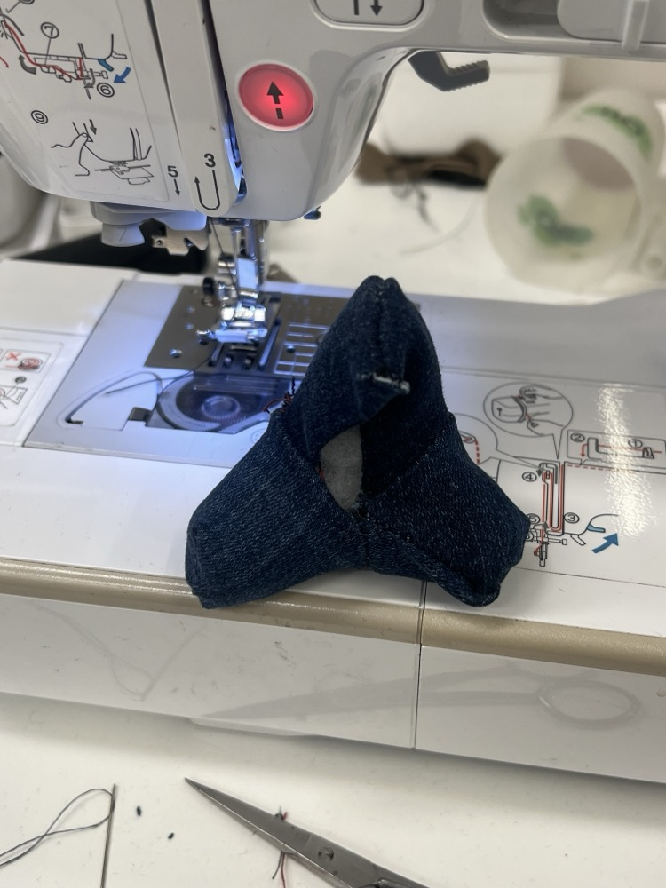

# Tetrapods of Many Materials

This project showcases the creation of the same wave-breaker tetrapod miniature using various materials and manufacturing techniques.

## Overview

A tetrapod can be constructed in CAD by rotating one arm from a flag-shape, then duplicating it and placing the copy at an angle equal to the dihedral angle of a tetrahedron (acos(-1/3)) about the center. The remaining two arms are created by cloning one arm about the axis of the other in a circular pattern.

This repository uses a tetrapod with arm length 40, and arm end diameter 10. The draft angle is set such that the outline of two arms meet at a 90 deg angle when viewed normal to their plane. A 1 mm chamfer is applied to the end of the arm when possible.

## FDM Printed Tetrapod

This is the simplest file in the set. It is simply the 3D shape of the final product as an STL file. A 3D printer is able to reproduce it in one shot, and no assembly or post-processing is needed.

Notice that there is only one, somewhat counter-intuitive, way to orient the object for printing, that doesn't require supports.

A two-color variation is available, with a segmented outer shell and a differently-colored inner part.

## SLA Printed Tetrapod

SLA printing can achieve high resolution and intricate details, so a skeleton tetrapod, filled with a tetrahedral lattice formed of 1:10 scale mini tetrapods was printed. Large solid volumes in SLA prints must be hollowed out and one must be mindful of the draining of such hollow cavities. These issues were circumvented by using a design with only thin, skeleton-like elements.

Some post-processing is involved. The part must be cleaned of uncured resin, and the many support structures must be cut off and cleaned.

## Laser Cut Tetrapod

14 interlocking pieces are cut out of 3 mm thick flat stock, such as plywood or acrylic. The slots in the mating pieces must be sized to account for the thickness of the material, the kerf of the cutting tool, and the angle they butt against each other at.

Produce 2 x L, 2 x Ma, 2 x Mb, 4 x S, 4 x Cap pieces.

The pieces must be assembled in a certain order.

## Papercraft Tetrapod
 

Each arm of the tetrapod is unrolled to a fan-shape, and cut out of card. Here, tape is used to join the pieces together, but tabs and slots could be used.

The unrolled shape of a tetrapod truncated cone can be developed with sketch tools, or here I've also achieved the same shape using a little hack. I recreate the surface with the Sheet Metal workspace in Fusion 360, and let the software unroll (unfold) it. Any surface with null curvature should be reproducible with this technique.

## Cloth Tetrapod

The same unrolled shape from the papercraft tetrapod was used as a template to cut cloth. 10-20 mm flanges were left outside the lines, to have some fabric outside the seams. The four pieces of cloth were sewn together with a sewing machine, inside out, and then all reversed through one remaining seam, which was hand-sewn together after stuffing.

The ends of the arms were sewn closed with a bit of extra cloth outside the marked line to account for the end. For lack of a better technique, this was done by eye.

Must develop a better way to keep the two pieces of cloth aligned when sewing a seam, and better ways to cap off a cone or a cylinder.

Eye-shaped buttons were printed on the FDM printer by printing a single-layer black shape on the print plate, then printing a button over it in white.

## Plaster of Paris Tetrapod

A tetrahedral four-piece mold is FDM printed and used to cast a tetrapod. The mold could be cut in different ways, but this way of dividing it has relatively little steep parting angles.

Notice you only need to design the negative of one sixth of one arm, and fill out the rest by mirroring.

Plaster of Paris is quite thick, so no gaskets are needed. The mold is held together and tightened with friction-fit rings, similar to those iron rings holding old-timey barrels together.

The flute created by the pour is cut off with a saw and sanded. The cast replicates the 3D printed layer lines, and the seams have visible flashing, which can be sanded off.

## Candle Tetrapod

The same FDM printed mold can be used to cast a four-way candle. Wick (rolled up tissue paper or cloth) can be strung along all four anxes of the tetrapod arms by hooking two pieces around each other. A version of the mold with slots to hold the wick is provided.

Paraffin melts around 50 deg C and the volume is not great, so pouring melted wax into a mold 3D printed in PLA plastic is not an issue. It doesn't have enough energy to melt the mold.

It's best to heat the wax until it all melts, then let it cool until near melting point again. Look for it to get white around the edges when stirring. The wax can leak out between the mold pieces when too hot, but when it's cooler, it becomes viscous when meeting with the mold surface, and doesn't have enough time to leak.

## Vacuum Formed Tetrapod

To do

## CNC Machined Tetrapod

To do

## Water Jet Tetrapod

To do

## Lathe-Turned Tetrapod

A desktop lathe was used to turn wooden cones. The taper of the cone is not critical, but I like to set it at 9.7 deg. (This makes the outline of two adjacent arms meet at a straight angle)

A 3D printed jig is used to cut the straight faces where the arms meet, and to cut the cone off at the correct length. A hand saw is used to rough the cut, then a disc sander. The table and the sanding surface have been set to 90 deg, and the jig has a surface at 90 degrees to the cut.

The taper is consistent between arms turned in the same batch, but won't be accurate between batches. For that reason, the jig doesn't have a conical hole, but a cylinder. The fat end of the work piece registers with the entrace of the cylindrical hole, and the thin end is aligned axially with a compliant spacing ring. The ring touches the cone and the cylinder at three points each, ensuring aligment.

The ring and the work piece are fit to the jig with a friction fit.

